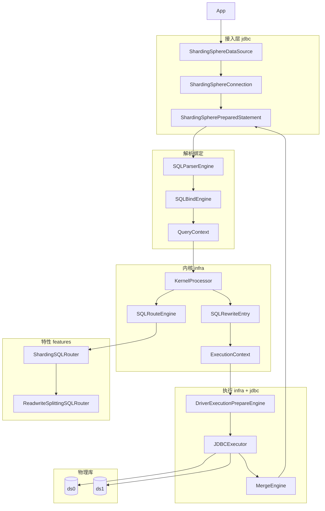
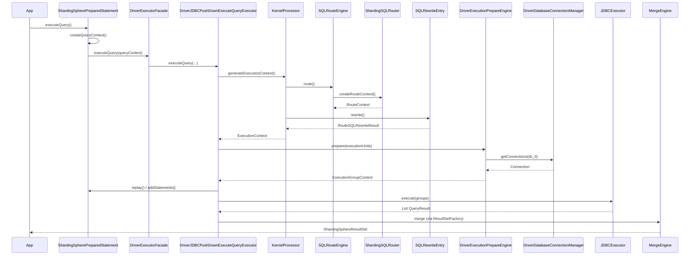

# ShardingSphere JDBC 内核原理与源码 Walkthrough

> 基于当前仓库源码梳理，面向分片场景下的 SQL 路由与执行链路。  
> 核心结论：**JDBC 是薄封装，与 Proxy 共用 `KernelProcessor`（校验 → 路由 → 改写 → 执行单元）+ JDBC Push Down 执行 + 结果归并。**

---

## 目录

1. [模块与职责](#1-模块与职责)
2. [整体架构](#2-整体架构)
3. [启动：DataSource 与 ContextManager](#3-启动datasource-与-contextmanager)
4. [连接与 Statement 生命周期](#4-连接与-statement-生命周期)
5. [完整 Walkthrough：分片 SELECT（PreparedStatement）](#5-完整-walkthrough分片-selectpreparedstatement)
6. [KernelProcessor 流水线](#6-kernelprocessor-流水线)
7. [路由引擎详解](#7-路由引擎详解)
8. [SQL 改写详解](#8-sql-改写详解)
9. [执行准备与物理下发](#9-执行准备与物理下发)
10. [结果归并](#10-结果归并)
11. [其他执行路径](#11-其他执行路径)
12. [调试断点速查](#12-调试断点速查)
13. [关键类索引](#13-关键类索引)

---

## 1. 模块与职责

| 模块 | 路径（示例） | 职责 |
|------|-------------|------|
| `jdbc` | `jdbc/src/main/java/.../driver/` | JDBC API 适配、连接/Statement 管理、驱动侧执行编排 |
| `parser` | `parser/sql/` | ANTLR4 方言解析，产出 `SQLStatement` AST |
| `infra/binder` | `infra/binder/` | AST 与元数据绑定 → `SQLStatementContext` |
| `infra/route` | `infra/route/` | `SQLRouteEngine` 编排各 Feature 路由器 |
| `infra/rewrite` | `infra/rewrite/` | Token 化 SQL 改写 |
| `infra/context` | `infra/context/` | **`KernelProcessor`** 内核入口 |
| `infra/executor` | `infra/executor/` | 执行单元、连接分组、JDBC 并行执行 |
| `infra/merge` | `infra/merge/` | 多分片 `QueryResult` 归并 |
| `features/sharding` | `features/sharding/core/` | 分片条件、路由引擎、改写装饰器 |
| `features/readwrite-splitting` | `features/readwrite-splitting/` | 读写分离（装饰路由） |
| `kernel/sql-federation` | `kernel/sql-federation/` | Calcite 联邦查询（跨库 JOIN 等） |

---

## 2. 整体架构



**数据流一句话**：逻辑 SQL → AST/Context → 路由到 `RouteUnit` → 改写为多条物理 SQL → 按数据源取连接建 Statement → 并行执行 → 查询类再归并为一个 `ResultSet`。

---

## 3. 启动：DataSource 与 ContextManager

### 3.1 入口

- 编程式：`ShardingSphereDataSourceFactory.createDataSource(...)`
- Driver URL：`jdbc:shardingsphere:...` → `ShardingSphereDriver` → `DriverDataSourceCache`

### 3.2 构建运行时

`ShardingSphereDataSource` 构造时调用 `ContextManagerBuilder.build(...)`：

- 注入物理 `Map<String, DataSource>`
- 加载 `RuleConfiguration`（Sharding、Readwrite-splitting、Encrypt 等）
- 构建 `ShardingSphereMetaData`（库表元数据、规则实例）
- 注册全局 `SQLParserRule`、执行线程池 `ExecutorEngine` 等

**源码位置**：`jdbc/.../ShardingSphereDataSource.java` → `createContextManager(...)`

### 3.3 获取连接

```java
// ShardingSphereDataSource.getConnection()
return DriverStateContext.getConnection(databaseName, contextManager);
// → ShardingSphereConnection(currentDatabaseName, contextManager)
```

`ShardingSphereConnection` 持有：

- `ContextManager`：元数据、规则、模式治理
- `DriverDatabaseConnectionManager`：按数据源名缓存/创建物理 `Connection`
- `processId`：SQL 执行过程追踪（`ProcessEngine`）

---

## 4. 连接与 Statement 生命周期

### 4.1 PreparedStatement 构造（解析只做一次）

**文件**：`jdbc/.../ShardingSpherePreparedStatement.java`

| 步骤 | 代码要点 | 产出 |
|------|----------|------|
| 去 Hint | `SQLHintUtils.removeHint(originSQL)` | 纯 SQL 字符串 |
| 提取 Hint | `SQLHintUtils.extractHint(originSQL)` | `HintValueContext` |
| 解析 | `SQLParserRule.getSQLParserEngine(protocolType).parse(sql, true)` | `SQLStatement` |
| 绑定 | `new SQLBindEngine(metaData, dbName, hint).bind(sqlStatement)` | `SQLStatementContext` |
| 选库 | `TablesContext.getDatabaseName().orElse(connection.getCurrentDatabaseName())` | `usedDatabase` |

```java
// ShardingSpherePreparedStatement 私有构造，约 L137-L156
sql = SQLHintUtils.removeHint(originSQL);
hintValueContext = SQLHintUtils.extractHint(originSQL);
SQLStatement sqlStatement = metaData.getGlobalRuleMetaData()
    .getSingleRule(SQLParserRule.class)
    .getSQLParserEngine(currentDatabase.getProtocolType())
    .parse(sql, true);
sqlStatementContext = new SQLBindEngine(metaData, connection.getCurrentDatabaseName(), hintValueContext)
    .bind(sqlStatement);
usedDatabase = metaData.getDatabase(usedDatabaseName);
driverExecutorFacade = new DriverExecutorFacade(connection, statementOption, statementManager,
    JDBCDriverType.PREPARED_STATEMENT, currentDatabase);
```

`SQLBindEngine.bind()` 按语句类型分发到 `DMLStatementBindEngine` / `DDLStatementBindEngine` / `DALStatementBindEngine`，生成如 `SelectStatementContext`、`InsertStatementContext`，并填充表、列、分页、主键生成等上下文。

### 4.2 执行时组装 QueryContext

每次 `executeQuery()` / `executeUpdate()` / `execute()` 调用：

```java
// createQueryContext()，约 L264-L269
List<Object> params = new ArrayList<>(getParameters());
if (sqlStatementContext instanceof ParameterAware) {
    ((ParameterAware) sqlStatementContext).bindParameters(params);
}
return new QueryContext(sqlStatementContext, sql, params, hintValueContext,
    connection.getDatabaseConnectionManager().getConnectionContext(), metaData, true);
```

`QueryContext` 是内核的统一输入：**语句上下文 + 原始 SQL + 参数 + Hint + 连接上下文 + 元数据**。

### 4.3 Statement 缓存优化

当所有规则都实现 `StorageConnectorReusableRuleAttribute` 且未使用 `HintManager` 时，`statementsCacheable == true`：

- 第二次执行同一条 PS 时，若 `statements` 非空，仅 `resetParameters()` + 对**已有**物理 PS `executeQuery()`，跳过完整内核流程。

---

## 5. 完整 Walkthrough：分片 SELECT（PreparedStatement）

### 场景假设

- 逻辑表 `t_order`，分库键 `user_id`，分表键 `order_id`
- SQL：`SELECT * FROM t_order WHERE user_id = ? AND order_id = ?`
- 参数：`user_id=10`, `order_id=100`
- 算法路由结果：`ds_0.t_order_0`

以下按**时间顺序**列出调用栈与关键对象变化。

---

### 阶段 A：应用调用 `executeQuery()`

```
ShardingSpherePreparedStatement.executeQuery()
  ├─ clearPrevious()                    // 清空上次 statements
  ├─ createQueryContext()               // 绑定参数到 Context
  ├─ handleAutoCommitBeforeExecution()
  └─ driverExecutorFacade.executeQuery(usedDatabase, metaData, queryContext, ...)
```

**文件**：`ShardingSpherePreparedStatement.java` L165-L177

---

### 阶段 B：DriverExecutorFacade → 审计 → Query 执行器

```
DriverExecutorFacade.executeQuery()
  ├─ SQLAuditEngine.audit(queryContext, database)   // 可选 SQL 审计
  └─ DriverExecuteQueryExecutor.executeQuery(...)
```

**文件**：`jdbc/.../DriverExecutorFacade.java` L104-L109

`DriverExecuteQueryExecutor` 分支：

1. `sqlFederationEngine.decide(...)` → 是否走 Calcite 联邦（跨库复杂查询）
2. 否则 `DriverJDBCPushDownExecuteQueryExecutor.executeQuery(...)`（常规路径）

**文件**：`jdbc/.../DriverExecuteQueryExecutor.java` L84-L90

---

### 阶段 C：内核生成 ExecutionContext

```
DriverJDBCPushDownExecuteQueryExecutor.getQueryResults()
  └─ new KernelProcessor().generateExecutionContext(queryContext, globalRuleMetaData, props)
```

#### C.1 校验 `check()`

```
SupportedSQLCheckEngine.checkSQL(rules, sqlStatementContext, database)
```

校验 SQL 类型、分片键必填等（可被 Hint `skipMetadataValidate` 跳过）。

**文件**：`infra/context/.../KernelProcessor.java` L58-L64

#### C.2 路由 `route()`

```
new SQLRouteEngine(database.getRuleMetaData().getRules(), props)
    .route(queryContext, globalRuleMetaData, database)
```

见 [第 7 节](#7-路由引擎详解)。  
产出 **`RouteContext`**，内含若干 **`RouteUnit`**：

```
RouteUnit:
  dataSourceMapper: logicName=ds_0, actualName=ds_0  (读写分离后 actual 可能变)
  tableMappers:     logicName=t_order, actualName=t_order_0
```

#### C.3 改写 `rewrite()`

```
new SQLRewriteEntry(usedDatabase, globalRuleMetaData, props)
    .rewrite(queryContext, routeContext)
```

见 [第 8 节](#8-sql-改写详解)。  
产出 **`RouteSQLRewriteResult`**：`Map<RouteUnit, SQLRewriteUnit>`，每条物理 SQL + 参数列表。

#### C.4 构建执行单元

```
ExecutionContextBuilder.build(database, rewriteResult, sqlStatementContext)
```

对每个 `RouteUnit` 生成 **`ExecutionUnit`**：

```java
// ExecutionContextBuilder.java L69-L74
new ExecutionUnit(
    entry.getKey().getDataSourceMapper().getActualName(),  // 物理数据源名
    new SQLUnit(
        entry.getValue().getSql(),                          // 改写后 SQL
        entry.getValue().getParameters(),                   // 改写后参数
        getRouteTableRouteMappers(entry.getKey().getTableMappers())
    )
);
```

**文件**：`infra/executor/.../ExecutionContextBuilder.java`

最终 **`ExecutionContext`** = `QueryContext` + `Collection<ExecutionUnit>` + `RouteContext`。

---

### 阶段 D：执行准备（连接 + Statement）

```
DriverExecutionPrepareEngine.prepare(databaseName, executionContext, executionUnits, reportContext)
```

**AbstractExecutionPrepareEngine** 逻辑（`infra/executor/.../AbstractExecutionPrepareEngine.java`）：

1. **按数据源聚合** `ExecutionUnit`（`TreeMap<dataSourceName, List<ExecutionUnit>>`）
2. **分组** `Lists.partition`：受 `max-connections-size-per-query` 限制，决定每个连接上承载几条 SQL
3. **连接模式**：
   - `MEMORY_STRICTLY`：连接数少，多条 SQL 复用连接（内存友好）
   - `CONNECTION_STRICTLY`：SQL 条数 > 最大连接数时，尽量一 SQL 一连接
4. **`DriverExecutionPrepareEngine.group()`**：
   - `databaseConnectionManager.getConnections(db, ds, offset, size, mode)`
   - `SQLExecutionUnitBuilder.build(...)` → 创建物理 `PreparedStatement`，包装为 `JDBCExecutionUnit`

**物理连接获取**（`DriverDatabaseConnectionManager`）：

```java
// getConnections0() 要点
// 1. cacheKey = databaseName + dataSourceName
// 2. 事务中优先复用 TransactionConnectionContext 里的连接
// 3. 否则 dataSource.getConnection()
// 4. cachedConnections 在逻辑连接生命周期内缓存
```

**文件**：`jdbc/.../DriverDatabaseConnectionManager.java` L330-L410

回调到 JDBC 层：

```java
// DriverJDBCPushDownExecuteQueryExecutor.getQueryResults()
for (ExecutionGroup<JDBCExecutionUnit> each : executionGroupContext.getInputGroups()) {
    addCallback.add(statements, parameterSets);  // → ShardingSpherePreparedStatement.addStatements
}
replayCallback.replay();  // 将 setInt/setString 等回放到每个物理 PS
```

**replay 机制**：逻辑 PS 上的 `MethodInvocationRecorder` 记录 setter 调用，对每个物理 PS 重放。

---

### 阶段 E：并行执行

```
ProcessEngine.executeSQL(executionGroupContext, queryContext)  // 登记 RUNNING 状态
jdbcExecutor.execute(executionGroupContext, ExecuteQueryCallback)
ProcessEngine.completeSQLExecution(processId)
```

**JDBCExecutor** 使用 `ExecutorEngine` 对 `ExecutionGroup` 内各 `JDBCExecutionUnit` **并行**调用 `PreparedStatement.executeQuery()`，返回 `List<QueryResult>`（通常为 `JDBCStreamQueryResult`）。

**文件**：`infra/executor/.../JDBCExecutor.java`

---

### 阶段 F：封装 ResultSet（含归并）

```
ShardingSphereResultSetFactory.newInstance(database, queryContext, queryResults, statement, columnLabelAndIndexMap)
  └─ MergeEngine.merge(queryResults, queryContext)   // 多分片时
  └─ new ShardingSphereResultSet(...)
```

应用看到的是**单个** `ShardingSphereResultSet`，内部 `MergedResult` 可能在做 ORDER BY 归并、聚合等。

**文件**：`jdbc/.../DriverJDBCPushDownExecuteQueryExecutor.java` L96-L97  
**归并**：`infra/merge/.../MergeEngine.java` L81-L84

---

### 阶段 G：execute() 与 getResultSet() 分离

若使用 `execute()` + `getResultSet()`：

1. `DriverExecuteExecutor.execute()` 走路径同 UPDATE，返回 boolean
2. 之后 `ShardingSpherePreparedStatement.getResultSet()` → `driverExecutorFacade.getResultSet()` → `DriverJDBCPushDownExecuteExecutor.getResultSet()` → `MergeEngine`

---

### Walkthrough 时序图（SELECT）



---

## 6. KernelProcessor 流水线

**文件**：`infra/context/src/main/java/org/apache/shardingsphere/infra/connection/kernel/KernelProcessor.java`

```java
public ExecutionContext generateExecutionContext(...) {
    check(queryContext);                                    // ① 校验
    RouteContext routeContext = route(...);                   // ② 路由
    SQLRewriteResult rewriteResult = rewrite(..., routeContext); // ③ 改写
    ExecutionContext result = createExecutionContext(...);  // ④ 执行单元
    logSQL(...);                                            // ⑤ 可选日志 sql-show
    return result;
}
```

| 步骤 | 输入 | 输出 |
|------|------|------|
| check | `QueryContext` | void / 抛异常 |
| route | rules + queryContext | `RouteContext` |
| rewrite | queryContext + routeContext | `GenericSQLRewriteResult` 或 `RouteSQLRewriteResult` |
| build | rewriteResult | `Collection<ExecutionUnit>` |

**与 Proxy 的关系**：Proxy 后端连接器同样调用 `KernelProcessor`，仅接入层协议不同。

---

## 7. 路由引擎详解

### 7.1 SQLRouteEngine 编排

**文件**：`infra/route/.../SQLRouteEngine.java`

```
route():
  1. Hint 指定数据源? → 直接单 RouteUnit 返回
  2. dataNodeRouters (Entrance)  → 分片等，创建初始 RouteContext
  3. TablelessSQLRouter          → 无表语句（如 SELECT 1）
  4. dataSourceRouters (Decorate) → 读写分离等，修饰 RouteUnit
  5. 仅 1 个 StorageUnit? → 兜底单库路由
```

**Entrance vs Decorate**：

| 类型 | SPI 接口 | 时机 | 示例 |
|------|----------|------|------|
| Entrance | `EntranceSQLRouter` | `RouteUnits` 为空时创建 | `ShardingSQLRouter` |
| Decorate | `DecorateSQLRouter` | 已有 RouteUnits 时修改 | `ReadwriteSplittingSQLRouter` |

路由器通过 `OrderedSPILoader.getServices(SQLRouter.class, rules)` 按规则顺序加载。

### 7.2 分片路由 ShardingSQLRouter

**文件**：`features/sharding/.../ShardingSQLRouter.java`

```
createRouteContext0():
  1. logicTableNames = rule.getShardingLogicTableNames(tableNames)
  2. shardingConditions = ShardingConditionEngine.createShardingConditions(...)
  3. DML 且 needMerge → shardingConditions.merge()
  4. engine = ShardingRouteEngineFactory.newInstance(...)
  5. result = engine.route(rule)
  6. ShardingRouteContextCheckerFactory 校验（全路由、分页等）
```

### 7.3 分片条件提取

**ShardingConditionEngine** 分支：

- `InsertStatementContext` → `InsertClauseShardingConditionEngine`（从 INSERT 列值提取）
- 其他 → `WhereClauseShardingConditionEngine`

**Where 提取核心**（`WhereClauseShardingConditionEngine`）：

1. `SQLStatementContextExtractor.getAllWhereSegments(context)`
2. `ExpressionExtractor.extractAndPredicates` 拆 AND
3. 对每个谓词 `ColumnExtractor.extract`，匹配 `rule.findShardingColumn`
4. `ConditionValueGeneratorFactory.generate` 生成 `ListShardingConditionValue` / `RangeShardingConditionValue`
5. 多谓词合并为 `ShardingCondition`

### 7.4 路由引擎工厂

**文件**：`features/sharding/.../ShardingRouteEngineFactory.java`

| SQL 类型 | 引擎 | 行为 |
|----------|------|------|
| DDL | `ShardingTableBroadcastRouteEngine` | 广播到相关分表 |
| DAL | `ShardingUnicastRouteEngine` / Broadcast | 管理类语句 |
| DCL | Instance/Table Broadcast | 权限类 |
| DML 无条件 / always false | `ShardingUnicastRouteEngine` | 随机单分片 |
| 单表标准分片 | `ShardingStandardRouteEngine` | 库表算法各算一遍 |
| 多表绑定 / 非标准 | `ShardingComplexRouteEngine` | 多表 + 可能笛卡尔 `ShardingCartesianRouteEngine` |

**标准路由**（`ShardingStandardRouteEngine.route()`）：

```java
for (DataNode each : dataNodes) {
    result.getRouteUnits().add(new RouteUnit(
        new RouteMapper(each.getDataSourceName(), each.getDataSourceName()),
        Collections.singleton(new RouteMapper(logicTableName, each.getTableName()))
    ));
}
```

`getDataNodes()` 内部：

- `routeDataSources()` → `databaseShardingStrategy.doSharding(...)` 调用分库算法 SPI
- `routeTables()` → `tableShardingStrategy.doSharding(...)` 调用分表算法 SPI

### 7.5 读写分离装饰

**文件**：`features/readwrite-splitting/.../ReadwriteSplittingSQLRouter.java`

遍历每个 `RouteUnit`，将 `dataSourceMapper.actualName` 从逻辑组名替换为：

```java
new ReadwriteSplittingDataSourceRouter(optional, connectionContext)
    .route(sqlStatementContext, hintValueContext);  // 主库 or 从库
```

发生在分片**之后**，因此分片先定「逻辑数据源」，读写分离再定「物理实例」。

---

## 8. SQL 改写详解

### 8.1 SQLRewriteEntry

**文件**：`infra/rewrite/.../SQLRewriteEntry.java`

```
rewrite():
  1. createSQLRewriteContext()
     - DefaultTokenGeneratorBuilder  // 通用 Token
     - decorators (SPI)              // 分片、加密等 ShardingSQLRewriteContextDecorator
     - generateSQLTokens()
  2. routeUnits 为空 → GenericSQLRewriteEngine
     routeUnits 非空 → RouteSQLRewriteEngine  // 按 RouteUnit 生成多条 SQL
```

### 8.2 分片改写装饰器

**文件**：`features/sharding/.../ShardingSQLRewriteContextDecorator.java`

- 注册 `ShardingTokenGenerateBuilder` 生成的 Token（表名替换、分页改写等）
- `ParameterRewritersBuilder` + `ShardingParameterRewritersRegistry` 改写参数（如分页参数、分片键相关）

改写后示例：

```sql
-- 逻辑
SELECT * FROM t_order WHERE user_id = ? AND order_id = ?

-- 物理 (ds_0)
SELECT * FROM t_order_0 WHERE user_id = ? AND order_id = ?
```

### 8.3 RouteSQLRewriteEngine

- 每个 `RouteUnit` 一条 `SQLRewriteUnit`
- 支持同数据源多 RouteUnit 的 **UNION 聚合改写**（`max-union-size-per-datasource`）
- 经 `SQLTranslatorRule` 做方言翻译（如 Oracle ↔ MySQL）

---

## 9. 执行准备与物理下发

### 9.1 执行分组

**配置**：`max-connections-size-per-query`（默认影响单查询最大连接数）

```
同一 dataSource 下 N 个 ExecutionUnit
  → partition 为若干组，每组大小 ≤ ceil(N / maxConnections)
  → 每组对应一个 Connection，组内多个 JDBCExecutionUnit 顺序执行
```

### 9.2 JDBCExecutionUnit

包含：

- `ExecutionUnit`（dataSourceName + SQLUnit）
- `Connection`（物理）
- `PreparedStatement` / `Statement`（`storageResource`）

### 9.3 DriverJDBCPushDownExecuteExecutor（UPDATE/execute）

**文件**：`jdbc/.../DriverJDBCPushDownExecuteExecutor.java`

与 Query 类似，区别：

- 使用 `ExecuteCallbackFactory` 调用 `executeUpdate` / `execute`
- DDL 可能在非 autoCommit 下隐式 `commit()`
- `PushDownMetaDataRefreshEngine.refresh()` 在 DDL 后刷新元数据

### 9.4 事务

`DriverTransactionalExecutor` 包装 `doExecute`：

- 分布式事务（XA/Seata）时协调多数据源提交
- `DriverDatabaseConnectionManager.begin()` / `commit()` / `rollback()` 与 `ConnectionContext` 联动

---

## 10. 结果归并

**文件**：`infra/merge/.../MergeEngine.java`

```java
public MergedResult merge(List<QueryResult> queryResults, QueryContext queryContext) {
    MergedResult mergedResult = executeMerge(...).orElseGet(() -> new TransparentMergedResult(queryResults.get(0)));
    return decorate(mergedResult, queryContext);
}
```

| 阶段 | SPI | 作用 |
|------|-----|------|
| merge | `ResultMergerEngine`（如 Sharding） | ORDER BY 流式归并、GROUP BY 聚合、分页截断 |
| decorate | `ResultDecoratorEngine`（如 Encrypt） | 解密等行后处理 |

单分片且无归并规则时，`TransparentMergedResult` 直接透传第一个 `QueryResult`。

---

## 11. 其他执行路径

### 11.1 SQL Federation（联邦查询）

**触发**：`SQLFederationEngine.decide()` 为 true（跨库、复杂 JOIN、配置 `sql-federation-enabled` 等）

**文件**：`kernel/sql-federation/.../SQLFederationEngine.java`

- Calcite 解析优化 → `SQLFederationExecutionPlan`
- `EnumerableScanImplementor` 在需要时回调 JDBC 执行子查询

**JDBC 入口**：`DriverExecuteExecutor` / `DriverExecuteQueryExecutor` 优先判断联邦分支。

### 11.2 Raw Push Down

若存在 `RawExecutionRuleAttribute` 规则（部分特殊场景），走 `DriverRawPushDownExecuteExecutor`，绕过标准 JDBC Statement 路径。

### 11.3 Batch

`ShardingSpherePreparedStatement.addBatch()`：

- 每次 `addBatch` 构建独立 `QueryContext` 加入 `DriverExecuteBatchExecutor`
- `executeBatch()` 批量走内核，可能产生多组 ExecutionUnit

### 11.4 TCL 事务语句

`DriverTransactionSQLStatementExecutor` 处理 `BEGIN`/`COMMIT`/`ROLLBACK` 等，不经过 `KernelProcessor`。

---

## 12. 调试断点速查

| 关注点 | 类 | 方法 |
|--------|-----|------|
| PS 执行入口 | `ShardingSpherePreparedStatement` | `executeQuery` |
| 内核入口 | `KernelProcessor` | `generateExecutionContext` |
| 路由编排 | `SQLRouteEngine` | `route` |
| 分片路由 | `ShardingSQLRouter` | `createRouteContext0` |
| 分片条件 | `WhereClauseShardingConditionEngine` | `createShardingConditions` |
| 标准分片 | `ShardingStandardRouteEngine` | `route` / `getDataNodes` |
| 读写分离 | `ReadwriteSplittingSQLRouter` | `decorateRouteContext` |
| 改写入口 | `SQLRewriteEntry` | `rewrite` |
| 分片 Token | `ShardingSQLRewriteContextDecorator` | `decorate` |
| 执行单元 | `ExecutionContextBuilder` | `build` |
| 连接获取 | `DriverDatabaseConnectionManager` | `getConnections0` |
| 准备 Statement | `DriverExecutionPrepareEngine` | `group` |
| 并行执行 | `JDBCExecutor` | `execute` |
| 归并 | `MergeEngine` | `merge` |
| 联邦 | `SQLFederationEngine` | `decide` / `executeQuery` |

**配置**：`sql-show: true` 打印逻辑/实际 SQL（`KernelProcessor.logSQL`）。

---

## 13. 关键类索引

### JDBC 层

| 类 | 包路径 |
|----|--------|
| `ShardingSphereDriver` | `org.apache.shardingsphere.driver` |
| `ShardingSphereDataSource` | `org.apache.shardingsphere.driver.jdbc.core.datasource` |
| `ShardingSphereConnection` | `org.apache.shardingsphere.driver.jdbc.core.connection` |
| `DriverDatabaseConnectionManager` | `org.apache.shardingsphere.driver.jdbc.core.connection` |
| `ShardingSpherePreparedStatement` | `org.apache.shardingsphere.driver.jdbc.core.statement` |
| `DriverExecutorFacade` | `org.apache.shardingsphere.driver.executor.engine.facade` |
| `DriverExecuteQueryExecutor` | `org.apache.shardingsphere.driver.executor.engine` |
| `DriverExecuteExecutor` | `org.apache.shardingsphere.driver.executor.engine` |
| `DriverJDBCPushDownExecuteQueryExecutor` | `org.apache.shardingsphere.driver.executor.engine.pushdown.jdbc` |

### Infra 内核

| 类 | 包路径 |
|----|--------|
| `KernelProcessor` | `org.apache.shardingsphere.infra.connection.kernel` |
| `SQLRouteEngine` | `org.apache.shardingsphere.infra.route.engine` |
| `SQLRewriteEntry` | `org.apache.shardingsphere.infra.rewrite` |
| `ExecutionContextBuilder` | `org.apache.shardingsphere.infra.executor.sql.context` |
| `DriverExecutionPrepareEngine` | `org.apache.shardingsphere.infra.executor.sql.prepare.driver` |
| `JDBCExecutor` | `org.apache.shardingsphere.infra.executor.sql.execute.engine.driver.jdbc` |
| `MergeEngine` | `org.apache.shardingsphere.infra.merge` |
| `QueryContext` | `org.apache.shardingsphere.infra.session.query` |

### 分片 Feature

| 类 | 包路径 |
|----|--------|
| `ShardingSQLRouter` | `org.apache.shardingsphere.sharding.route.engine` |
| `ShardingRouteEngineFactory` | `org.apache.shardingsphere.sharding.route.engine.type` |
| `ShardingStandardRouteEngine` | `org.apache.shardingsphere.sharding.route.engine.type.standard` |
| `ShardingConditionEngine` | `org.apache.shardingsphere.sharding.route.engine.condition.engine` |
| `ShardingSQLRewriteContextDecorator` | `org.apache.shardingsphere.sharding.rewrite.context` |

---

## 附录：INSERT / 广播 / 绑定表 简述

### INSERT

- 分片条件来自 `InsertClauseShardingConditionEngine`（插入列中的分片键）
- 若包含自增主键，`GeneratedKeyContext` 在 bind 阶段建立；执行后 `getGeneratedKeys()` 合并多分片返回值

### 广播 DDL/DML

- `ShardingTableBroadcastRouteEngine`：为每个实际表生成 `RouteUnit`
- 改写阶段为每个分表生成独立 SQL

### 绑定表 JOIN

- `ShardingRouteEngineFactory` 判断 `allBindingTables` → 仍用 `ShardingStandardRouteEngine`，但分片键需满足绑定关系
- 否则 `ShardingComplexRouteEngine` + 可能的笛卡尔积路由

---

*文档生成自 ShardingSphere 源码树分析，若版本升级请以对应 tag 源码为准。*
